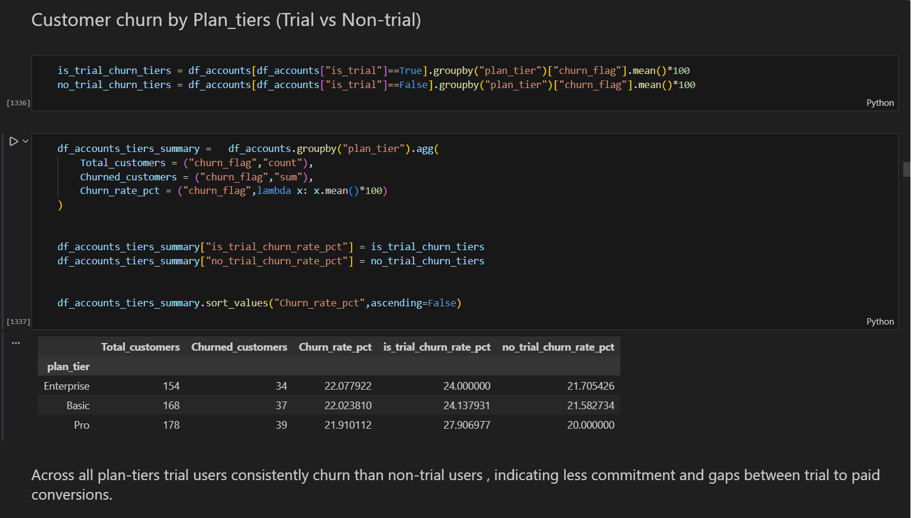
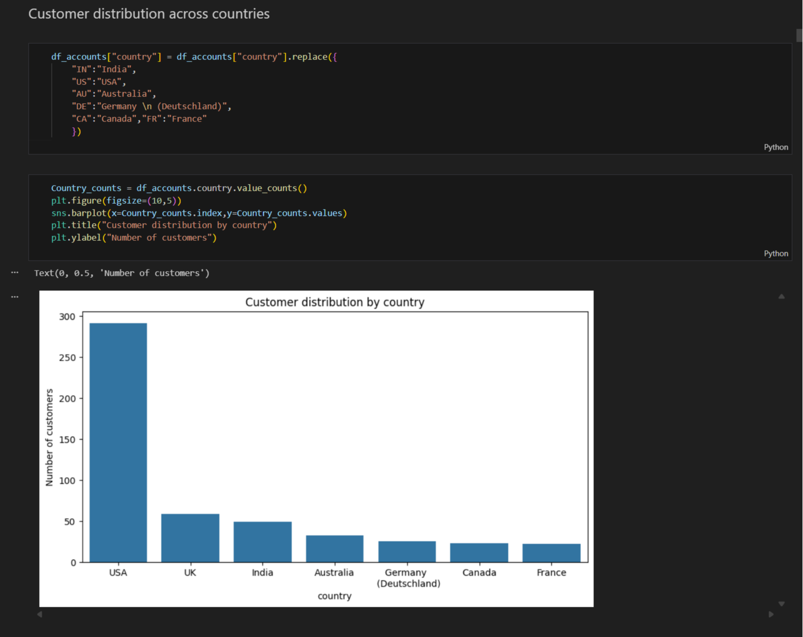
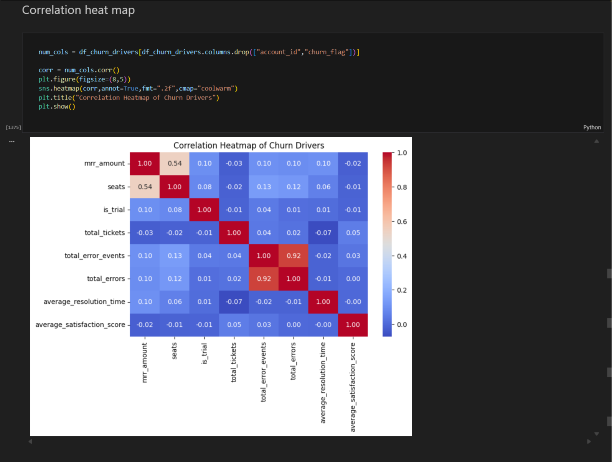

# SaaS-Customer-Churn-Analysis

## Overview
Customer churn is causing revenue leakage in RavenStack’s subscription business. This project analyzes customer segments, subscription behavior, product usage patterns, and churn risk signals to identify the key drivers of churn and provide actionable recommendations to improve retention and protect recurring revenue.

## Data Source
The dataset is a SaaS churn analytics dataset containing 5 tables:
- https://www.kaggle.com/datasets/rivalytics/saas-subscription-and-churn-analytics-dataset
- CSV files used in this project are included in `/data/`.

## Key Performance Indicators (KPIs)
- Churn Rate (%)
- Trial vs Non-Trial Churn Rate
- Churn Rate by Plan Tier / Country / Industry
- MRR / ARR Distribution
- Refund Rate & Average Refund Amount by Churn Reason
- Support Metrics
- Avg resolution time
- Avg satisfaction score

## Tools Used
- Python
- NumPy
- Pandas
- Matplotlib
- Seaborn

## Usage
```bash
pip install -r requirements.txt
```

## Preview
<div>
 
 
 
</div>


 
